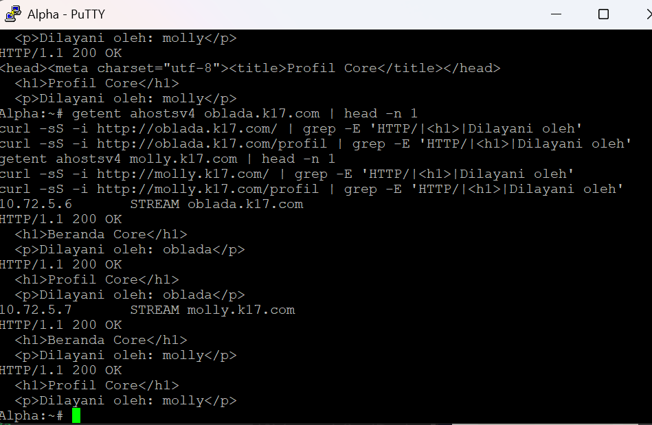
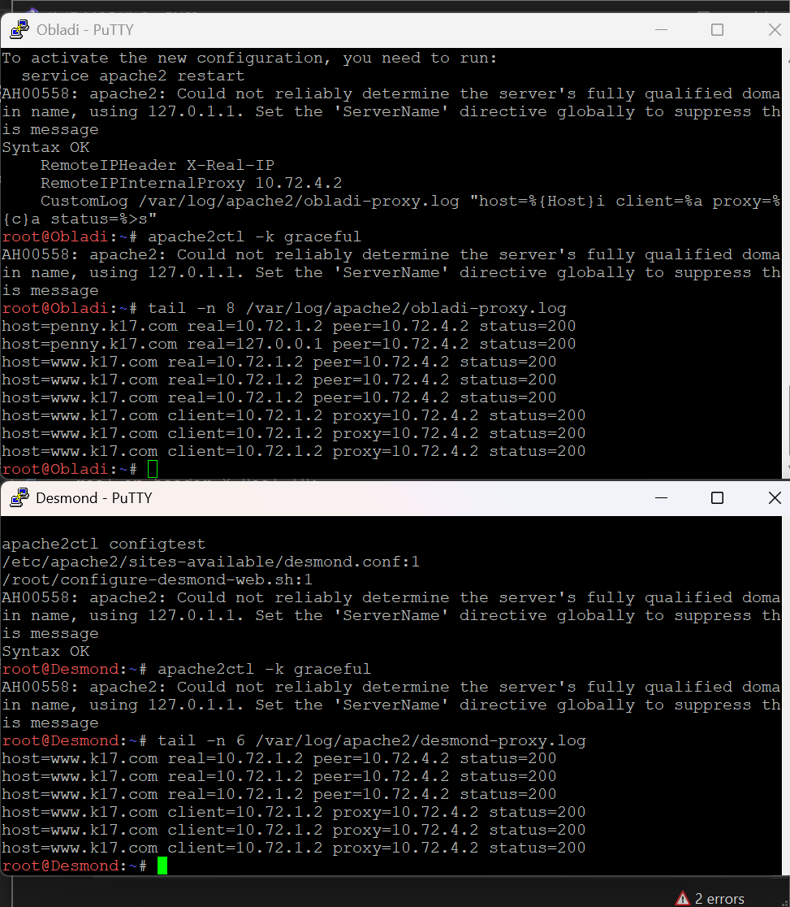
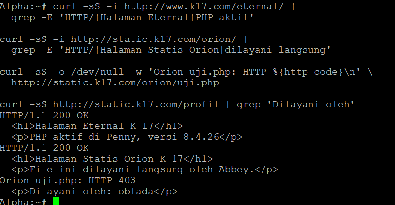

# Laporan Praktikum Modul 2 — Infrastruktur Layanan Jaringan K-17

Domain kelompok `k17.com`; jaringan internal lima subnet `/24` dengan prefix `10.72`. Laporan ini merangkum bukti pengerjaan yang telah dikirim. Ekspor GNS3 telah diterima; bukti tambahan mengikuti [daftar kelengkapan](KELENGKAPAN.md).

## Nomor 1–3 — Topologi, routing, dan NAT

Rootkit menghubungkan lima subnet menggunakan gateway 10.72.1.1 sampai 10.72.5.1. IP forwarding diaktifkan, dan sumber 10.72.0.0/16 menggunakan MASQUERADE melalui eth0. Ping internet berhasil pada node yang dikonfigurasi, dan Delta dapat mengakses Alpha lintas subnet tanpa packet loss pada pengujian yang dikirim.

WAN Rootkit pernah berubah dari 192.168.122.10 ke 192.168.122.237. Beberapa default route pernah mengarah ke IP node sendiri; route diperbaiki ke gateway Rootkit. NAT pernah hilang setelah restart dan dipulihkan dengan skrip. Rincian alamat ada pada [tabel IP](docs/ip-plan.md). Screenshot jaringan perlu ditambahkan dari berkas asli.

## Nomor 4–8 — DNS oleh Jude

Prab (10.72.5.2) menjadi master dan Tedd (10.72.5.3) menjadi slave. Keluaran terminal yang dikirim pada 30 September menunjukkan named aktif pada kedua node, named-checkconf berhasil, dan SOA k17.com memiliki serial yang sama 2026093001. Alpha berhasil me-resolve obladi.k17.com melalui Prab ke 10.72.5.4 dan desmond.k17.com melalui Tedd ke 10.72.5.5.

Laporan Jude menyebut A record seluruh node, vault/core dengan beberapa alamat, CNAME www/static, dan reverse zone subnet 3–5. Berkas konfigurasi final dan hasil query lengkap masih perlu dilampirkan. Serial di atas adalah hasil uji pada saat itu, bukan serial final pengumpulan.

## Nomor 9 — Backend statis Vault

[Dokumentasi](docs/09-vault-static.md): Apache pada Obladi dan Desmond melayani beranda serta autoindex /arsip/. Pengujian hostname dari Alpha memberi HTTP 200.

## Nomor 10 — Backend dinamis Core

[Dokumentasi](docs/10-core-dynamic.md): Nginx dan PHP-FPM pada Oblada/Molly melayani beranda serta /profil dengan rewrite internal ke profil.php. Kedua backend memberi HTTP 200 dari Alpha.

## Nomor 11 — Reverse proxy dan pembagian beban

[Dokumentasi](docs/11-reverse-proxy.md): Apache Penny membagi trafik ke Obladi/Desmond; Nginx Abbey ke Oblada/Molly. Respons kedua backend dan header Host/X-Real-IP terlihat pada pengujian. Konfigurasi awal dalam dokumen kemudian disesuaikan pada nomor 12–15; gunakan skrip final untuk pemulihan.

## Nomor 12 — Basic Auth

[Dokumentasi](docs/12-penny-basic-auth.md): /admin pada Penny memakai akun prabs. Tanpa login HTTP 401, dengan login HTTP 200. Setelah redirect kanonik nomor 13, alamat uji adalah http://www.k17.com/admin/. Password dimasukkan interaktif.

## Nomor 13 — Redirect kanonik

[Dokumentasi](docs/13-canonical-redirect.md): Penny/akses IP dialihkan 301 ke www.k17.com; Abbey/akses IP dialihkan 302 ke static.k17.com. Path tetap diteruskan, dan Abbey mempertahankan query string.

## Nomor 14 — Log IP pengunjung asli

[Dokumentasi](docs/14-real-client-ip.md): Apache mod_remoteip pada Obladi/Desmond hanya mempercayai Penny. Nginx realip pada Oblada/Molly hanya mempercayai Abbey. Log baru menunjukkan client Alpha 10.72.1.2 dan IP proxy masing-masing.

## Nomor 15 — Eternal dan Orion

[Dokumentasi](docs/15-eternal-orion.md): Eternal dilayani lokal oleh Penny dan merender PHP; Orion dilayani statis oleh Abbey. Keduanya HTTP 200, /orion/uji.php memberi 403, dan proxy /profil tetap berfungsi.

## Nomor 16–19 — Laporan Jude, bukti akhir menunggu

Jude melaporkan benchmark dengan ab -n 250 -c 10 untuk www dan static; TXT record klien; perubahan sementara TTL Abbey menjadi 15 detik dan alamat 10.72.3.99; CNAME outbound menuju http.badssl.com. Hasil terminal dan screenshot lengkap belum diterima dalam paket ini. Pengamatan caching memerlukan bukti TTL dan jalur resolver yang dipakai. Perbedaan panjang respons ab tidak dengan sendirinya membuktikan pembagian beban adil.

## Nomor 20 — Pemulihan dan autostart

Jude melaporkan pemulihan Abbey ke 10.72.3.2 dan penulisan rc.local untuk DNS/NAT. Bukti bahwa startup menjalankan skrip dan seluruh layanan web kembali normal setelah restart belum tersedia. Nomor ini belum dapat dinyatakan selesai dari dokumentasi yang diterima saja.

## Kesimpulan

Fungsi jaringan dan layanan web nomor 1–3 serta 9–15 telah ditunjukkan melalui keluaran terminal. Sebagian fungsi DNS master/slave teruji. Ekspor proyek GNS3 telah disimpan, tetapi belum diuji impor dan tidak memuat konfigurasi aktif BIND/Apache/Nginx. Pengumpulan lengkap masih membutuhkan zona DNS aktif final dan bukti Jude nomor 16–20.
