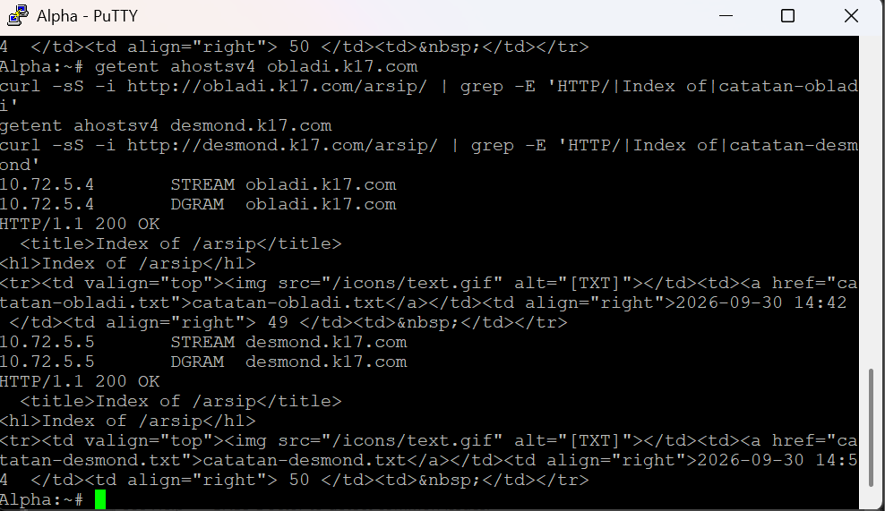
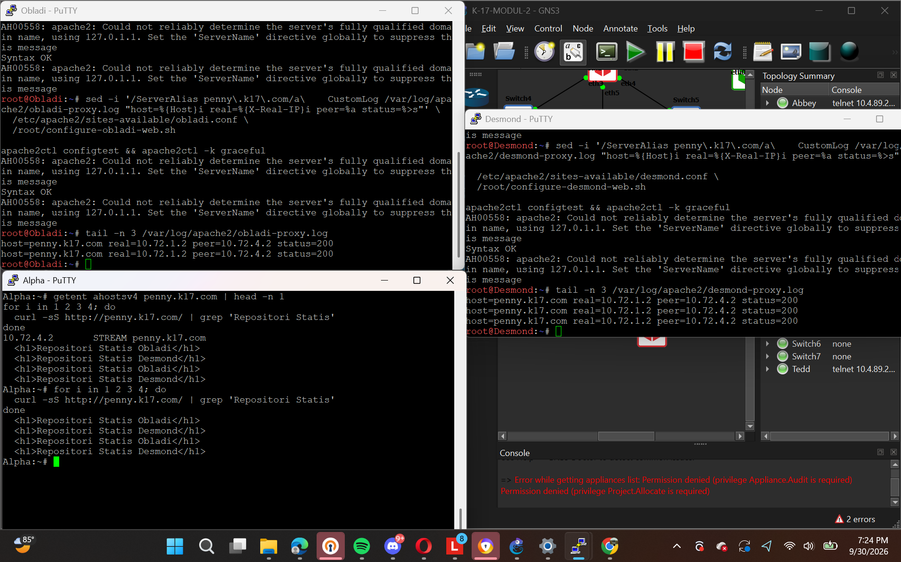
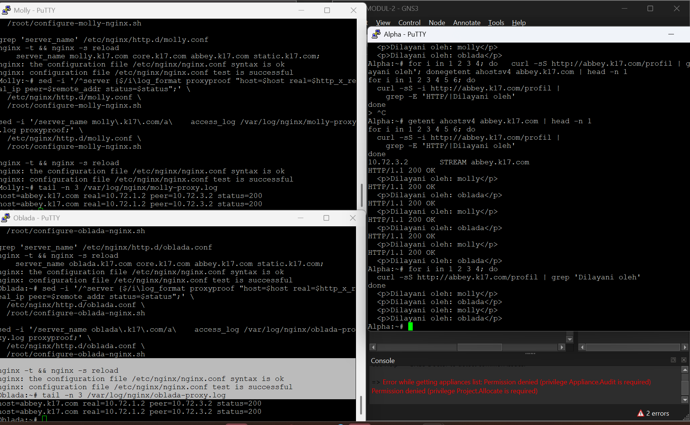
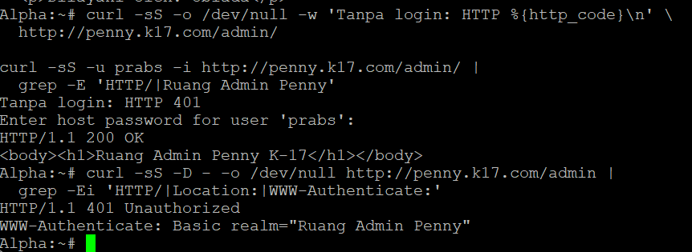

# LAPORAN PRAKTIKUM MODUL 2

## Identitas Kelompok

| Identitas | Keterangan |
| --- | --- |
| Kelompok | K-17 |
| Anggota | Dian Piramidiana Rachmatika (5027251031) 
Jude Athala Yazid Sari (5027251098) |
| Domain | `k17.com` |
| Prefix IP | `10.72.x.x/24` |
| Proyek | [K-17-MODUL-2.gns3project](01_Project_GNS3/K-17-MODUL-2.gns3project) |

Skrip berada di folder `02_Scripts_Per_Soal/Soal_XX`. Nama file diawali nama node tempat skrip dijalankan.

## 1. Topologi dan Pembagian IP

Topologi memakai Rootkit sebagai router, NAT1 sebagai jalur keluar, dan lima subnet untuk klien serta server. Gateway subnet 1–5 adalah `10.72.1.1` sampai `10.72.5.1`. Berkas GNS3 memuat 22 node dan 21 link.

| Cabang | Gateway Rootkit | Node |
| --- | --- | --- |
| `10.72.1.0/24` | `10.72.1.1` | Alpha, Beta, Gamma |
| `10.72.2.0/24` | `10.72.2.1` | Delta, Epsilon |
| `10.72.3.0/24` | `10.72.3.1` | Abbey |
| `10.72.4.0/24` | `10.72.4.1` | Penny |
| `10.72.5.0/24` | `10.72.5.1` | Prab, Tedd, Obladi, Desmond, Oblada, Molly |

## 2. Koneksi router

Interface `eth0` Rootkit terhubung ke NAT1 dengan gateway `192.168.122.1`. Saat diuji, Rootkit berhasil ping `8.8.8.8`. IP pada sisi NAT dapat berubah ketika node dinyalakan ulang.

```sh
ip route
ping -c 2 8.8.8.8
```

## 3. Routing dan NAT

Rootkit memakai `ip_forward=1` dan aturan MASQUERADE untuk sumber `10.72.0.0/16` melalui `eth0`. Klien menggunakan gateway `.1` pada subnetnya. Delta berhasil ping Alpha pada subnet berbeda, sedangkan klien yang diuji dapat mengakses internet.

```sh
# Di Rootkit
sysctl net.ipv4.ip_forward
iptables -t nat -L POSTROUTING -n -v
# Di Delta
ping -c 3 10.72.1.2
```

Hasil: forwarding bernilai `1`, aturan MASQUERADE muncul, dan ping Delta ke Alpha berhasil 3/3.

## 4. DNS utama dan pendamping

Prab (`10.72.5.2`) menjadi DNS utama dan Tedd (`10.72.5.3`) menjadi DNS pendamping. Keduanya menjalankan BIND dan pernah menjawab permintaan SOA `k17.com` dengan serial yang sama pada pengujian awal.

```sh
dig @10.72.5.2 k17.com SOA +short
dig @10.72.5.3 k17.com SOA +short
```

Hasil saat diuji: kedua server menjawab serial `2026093001`. Serial dapat berubah ketika zona diperbarui.

## 5. A record

Zona `k17.com` berisi alamat host Alpha sampai Molly. Contoh pengujian dari Alpha: `obladi.k17.com` menjawab `10.72.5.4` melalui Prab, dan `desmond.k17.com` menjawab `10.72.5.5` melalui Tedd.

```sh
nslookup obladi.k17.com 10.72.5.2
nslookup desmond.k17.com 10.72.5.3
```

## 6. Transfer zona

Tedd mengambil zona utama dan zona reverse subnet 3, 4, serta 5 dari Prab. Kecocokan SOA di kedua server menjadi salah satu pemeriksaan transfer zona.

Hasil pemeriksaan awal: Prab dan Tedd menjawab SOA yang sama. Keluaran transfer zona sesudah perubahan akhir belum disertakan.

## 7. Nama layanan

Nama `vault.k17.com` mempunyai dua alamat backend (`10.72.5.4` dan `10.72.5.5`), sedangkan `core.k17.com` mempunyai `10.72.5.6` dan `10.72.5.7`. Alias `www` menuju Penny dan `static` menuju Abbey.

```sh
dig @10.72.5.2 vault.k17.com +short
dig @10.72.5.2 core.k17.com +short
```

## 8. Reverse DNS

Zona reverse subnet 3, 4, dan 5 dibuat pada Prab untuk mengubah alamat IP kembali menjadi nama host. Berkas yang dibuat mencakup PTR Abbey, Penny, Prab, Tedd, Vault, dan Core.

```sh
dig @10.72.5.2 -x 10.72.3.2 +short
dig @10.72.5.2 -x 10.72.4.2 +short
```

Hasil query PTR akhir belum ada pada dokumentasi yang dikumpulkan.

## 9. Web statis Vault

Obladi dan Desmond menjalankan Apache. Halaman `/arsip/` menampilkan daftar dokumen, dan pengujian dari Alpha menghasilkan HTTP 200 untuk kedua node.

```sh
curl -I http://obladi.k17.com/arsip/
curl -I http://desmond.k17.com/arsip/
```



## 10. Web dinamis Core

Oblada dan Molly menjalankan Nginx dengan PHP-FPM. Halaman `/` dan `/profil` menampilkan nama backend yang melayani permintaan. Pengujian dari Alpha menghasilkan HTTP 200.

```sh
curl http://oblada.k17.com/profil
curl http://molly.k17.com/profil
```


## 11. Reverse proxy

Penny membagi permintaan web ke Obladi dan Desmond. Abbey membagi permintaan ke Oblada dan Molly. Permintaan berulang dari Alpha menampilkan respons kedua backend.

```sh
for i in 1 2 3 4; do curl -s http://www.k17.com/ | grep 'Repositori Statis'; done
for i in 1 2 3 4; do curl -s http://static.k17.com/profil | grep 'Dilayani oleh'; done
```





## 12. Basic Auth

Halaman `/admin/` pada Penny memerlukan login `prabs`. Tanpa login server memberi HTTP 401; setelah memasukkan password, halaman admin memberi HTTP 200.

```sh
curl -I http://www.k17.com/admin/
curl -u prabs -i http://www.k17.com/admin/
```



## 13. Redirect

`penny.k17.com` dialihkan ke `www.k17.com` dengan HTTP 301. `abbey.k17.com` dialihkan ke `static.k17.com` dengan HTTP 302. Path pada URL tetap terbawa.

```sh
curl -I http://penny.k17.com/admin/
curl -I 'http://abbey.k17.com/profil?uji=1'
```


## 14. IP pengunjung di backend

Penny mengirim IP pengunjung ke backend Vault; Abbey melakukan hal yang sama ke backend Core. Log pada backend memperlihatkan Alpha sebagai `client=10.72.1.2` dan alamat proxy secara terpisah.

Hasil log: Vault mencatat `proxy=10.72.4.2`, sedangkan Core mencatat `proxy=10.72.3.2`.


## 15. Eternal dan Orion

Penny melayani `/eternal/` memakai PHP. Abbey melayani `/orion/` sebagai halaman statis dan menolak file PHP contoh pada `/orion/uji.php` dengan HTTP 403. Kedua halaman utama memberi HTTP 200.

```sh
curl -I http://www.k17.com/eternal/
curl -I http://static.k17.com/orion/
curl -I http://static.k17.com/orion/uji.php
```


## 16. Benchmark

Perintah benchmark yang dipakai dalam catatan kelompok adalah `ab -n 250 -c 10` untuk `www.k17.com` dan `static.k17.com`. Keluaran lengkap benchmark perlu dicocokkan dengan hasil Jude sebelum angka performa dicantumkan.

## 17. TXT klien

TXT record pada Prab ditambahkan untuk Alpha, Beta, Gamma, Delta, dan Epsilon. Isi masing-masing adalah nama klien yang bersangkutan.

## 18. TTL dan cache DNS

Percobaan TTL dilakukan dengan mengubah sementara alamat Abbey ke `10.72.3.99` dengan TTL 15 detik. Setelah pengamatan cache, alamat Abbey perlu kembali ke `10.72.3.2`. Hasil uji cache lengkap belum disertakan.

## 19. CNAME eksternal

`outbound.k17.com` ditambahkan sebagai CNAME yang menunjuk `http.badssl.com.` pada zona Prab. Query DNS dan HTTP akhir masih perlu dicocokkan dengan hasil uji Jude.

## 20. Pemulihan layanan

Skrip jaringan, NAT, dan DNS disimpan untuk membantu pemulihan setelah node dijalankan lagi. Pemeriksaan sesudah restart harus meliputi gateway, NAT, DNS, Apache, Nginx, PHP-FPM, serta halaman web. Ekspor GNS3 membawa topologi dan skrip `/root`, tetapi file konfigurasi layanan di `/etc/bind`, `/etc/apache2`, dan `/etc/nginx` tidak ikut terbawa.

## Kesimpulan

Topologi, konfigurasi jaringan, DNS, dan layanan web kelompok K-17 telah disusun. Bukti pengujian web nomor 9–15 sudah dilampirkan. Hasil lengkap benchmark, cache DNS, dan uji pemulihan setelah impor proyek masih perlu disatukan dengan dokumentasi Jude.
